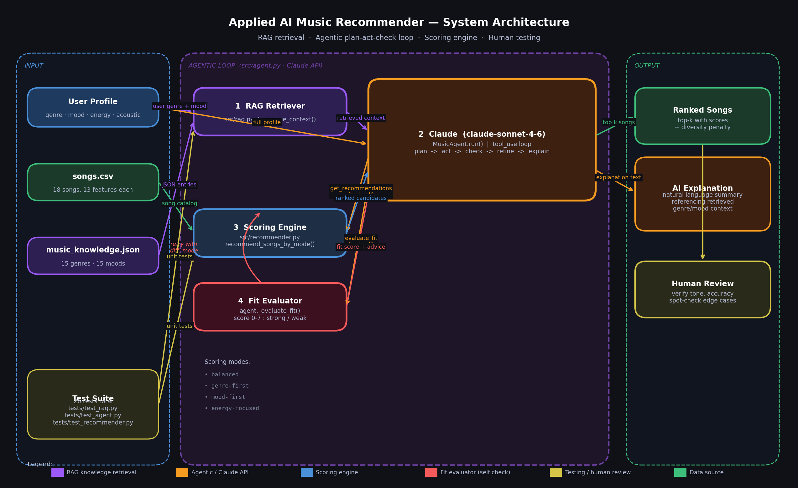

# Applied AI Music Recommender System

A content-based music recommendation engine extended with a Claude-powered
agentic loop and a Retrieval-Augmented Generation (RAG) knowledge base.
Built as a capstone evolution of the original Module 1–3 project.

---

## Original Project (Modules 1–3)

This project builds directly on
**[AI110 Module 3 — Music Recommender Simulation](https://github.com/sharif-alqaabi/ai110-module3show-musicrecommendersimulation-starter)**,
a rule-based content-filtering recommender written in Python.
The original system scored songs against a user taste profile using weighted
feature comparisons (genre, mood, energy, danceability, acousticness, tempo,
and valence) and returned an explainable ranked list with per-song reasons.
It supported multiple scoring modes, a diversity penalty to avoid repetitive
results, and a small hand-curated catalog of 18 songs stored in a CSV file.

---

## Title and Summary

**Applied AI Music Recommender System** turns a simple scoring engine into a
fully agentic AI pipeline. A listener describes what they want to hear — a
genre, a mood, an energy level — and the system:

1. Retrieves factual descriptions of that genre and mood from a curated
   knowledge base (RAG).
2. Runs the scoring recommender to get ranked song candidates.
3. Uses Claude to evaluate whether the top result actually fits the request.
4. Retries automatically with a different scoring strategy if the fit is weak.
5. Returns a natural-language explanation that references what was retrieved,
   not just generic boilerplate.

The project matters because it demonstrates how a deterministic rule-based
system and a generative AI model can work *together* — the rules give the AI
something accurate to reason about, and the AI gives the rules a voice that
a listener can actually understand.

---

## Architecture Overview



The diagram shows three zones:

### Input (left)
| Component | Role |
|---|---|
| **User Profile** | Dictionary of listener preferences passed at runtime |
| **songs.csv** | 18-song catalog with 13 audio features per song |
| **music_knowledge.json** | RAG knowledge base — genre/mood descriptions, typical energy ranges, related genres |
| **Test Suite** | 26 pytest tests that validate each layer independently |

### Agentic Loop (center — Claude API)
The loop runs inside `MusicAgent.run()` and follows a strict four-step plan:

```
PLAN  →  retrieve genre/mood context from knowledge base  (RAG)
ACT   →  run scoring engine to get candidates
CHECK →  evaluate fit of the top result (rule-based, score 0–7)
REFINE→  if fit < 4, retry with a different scoring mode
OUTPUT→  write natural-language summary referencing retrieved context
```

Claude orchestrates the loop via tool use. The three tools it can call are
`retrieve_music_knowledge`, `get_recommendations`, and `evaluate_fit`.
Claude decides when to call each tool and whether the results are good enough
to accept — that decision-making is what makes the workflow *agentic* rather
than a simple one-shot API call.

### Output (right)
| Component | Role |
|---|---|
| **Ranked Songs** | Top-k list with scores and per-song scoring reasons |
| **AI Explanation** | Natural-language summary that references retrieved context |
| **Human Review** | Manual spot-check of tone, accuracy, and edge cases |

---

## Setup Instructions

### Prerequisites

- Python 3.10 or higher
- An Anthropic API key (only required for `--ai` mode)

### 1. Clone the repository

```bash
git clone https://github.com/sharif-alqaabi/applied-ai-system-project.git
cd applied-ai-system-project
```

### 2. Create and activate a virtual environment

```bash
python -m venv .venv

# macOS / Linux
source .venv/bin/activate

# Windows
.venv\Scripts\activate
```

### 3. Install dependencies

```bash
pip install -r requirements.txt
```

`requirements.txt` installs: `anthropic`, `pandas`, `pytest`, `streamlit`.

### 4. Set your API key (for AI mode only)

```bash
export ANTHROPIC_API_KEY=your-key-here   # macOS / Linux
set ANTHROPIC_API_KEY=your-key-here      # Windows CMD
```

### 5. Run the system

**Scoring-based mode** (no API key needed):
```bash
python -m src.main
```

**AI-enhanced agentic mode** (requires API key):
```bash
python -m src.main --ai
```

### 6. Run the test suite

```bash
pytest
```

Expected output: **26 passed**.

---

## Sample Interactions

### Sample 1 — Scoring-based mode, Chill Lofi profile

**Input profile:**
```python
{
    "genre": "lofi",
    "mood": "chill",
    "energy": 0.35,
    "danceability": 0.55,
    "likes_acoustic": True,
    "tempo_bpm": 76,
    "valence": 0.60
}
```

**CLI output (`python -m src.main`):**
```
=== Chill Lofi ===

1. Library Rain by Paper Lanterns
   Score: 6.65
   Reasons: genre match (+2.00), mood match (+1.50), energy similarity (+1.50),
            danceability similarity (+0.73), acoustic fit (+0.43),
            tempo similarity (+0.24), valence similarity (+0.25)
   Vibe: lofi, chill, energy 0.35

2. Midnight Coding by LoRoom
   Score: 5.98
   Reasons: genre match (+2.00), mood match (+1.50), energy similarity (+1.40),
            danceability similarity (+0.70), acoustic fit (+0.35),
            tempo similarity (+0.24), valence similarity (+0.24),
            genre diversity penalty (-0.45)
   Vibe: lofi, chill, energy 0.42

3. Spacewalk Thoughts by Orbit Bloom
   Score: 4.45
   Reasons: mood match (+1.50), energy similarity (+1.40),
            danceability similarity (+0.64), acoustic fit (+0.46),
            tempo similarity (+0.21), valence similarity (+0.24)
   Vibe: ambient, chill, energy 0.28
```

**What this shows:** The top two results are exact genre-and-mood matches.
The third result (Spacewalk Thoughts) has a different genre — ambient — but
earns its place because its energy, danceability, and acoustic feel are very
close to what the profile asked for. The diversity penalty on Midnight Coding
demonstrates the system actively preventing a list of all-identical lofi songs.

---

### Sample 2 — Scoring-based mode, Deep Intense Rock profile

**Input profile:**
```python
{
    "genre": "rock",
    "mood": "intense",
    "energy": 0.92,
    "danceability": 0.50,
    "likes_acoustic": False,
    "tempo_bpm": 150,
    "valence": 0.45
}
```

**CLI output:**
```
=== Deep Intense Rock ===

1. Storm Runner by Voltline
   Score: 6.54
   Reasons: genre match (+2.00), mood match (+1.50), energy similarity (+1.48),
            danceability similarity (+0.63), acoustic fit (+0.45),
            tempo similarity (+0.24), valence similarity (+0.24)
   Vibe: rock, intense, energy 0.91

2. Iron Horizon by Ash Atlas
   Score: 4.59
   Reasons: mood match (+1.50), energy similarity (+1.43),
            danceability similarity (+0.74), acoustic fit (+0.48),
            tempo similarity (+0.21), valence similarity (+0.23)
   Vibe: metal, intense, energy 0.97

3. Gym Hero by Max Pulse
   Score: 4.29
   Reasons: mood match (+1.50), energy similarity (+1.48),
            danceability similarity (+0.46), acoustic fit (+0.47),
            tempo similarity (+0.21), valence similarity (+0.17)
   Vibe: pop, intense, energy 0.93
```

**What this shows:** Storm Runner is a clean genre-and-mood hit. Iron Horizon
(metal) and Gym Hero (pop) have no genre match but rank because their energy
and mood align closely. This reveals an important property of the system:
cross-genre songs with matching energy and mood surface naturally without any
special logic — the math handles it.

---

### Sample 3 — Scoring-based mode, Conflicted Edge Case profile

**Input profile:**
```python
{
    "genre": "classical",
    "mood": "moody",
    "energy": 0.92,          # high energy...
    "danceability": 0.25,
    "likes_acoustic": True,  # ...but also wants acoustic
    "tempo_bpm": 65,
    "valence": 0.30
}
```

**CLI output:**
```
=== Conflicted Edge Case ===

1. Quiet Constellations by Aria Vale
   Score: 3.99
   Reasons: genre match (+2.00), energy similarity (+0.39),
            danceability similarity (+0.71), acoustic fit (+0.49),
            tempo similarity (+0.23), valence similarity (+0.17)
   Vibe: classical, peaceful, energy 0.18

2. Night Drive Loop by Neon Echo
   Score: 3.58
   Reasons: mood match (+1.50), energy similarity (+1.24),
            danceability similarity (+0.39), acoustic fit (+0.11),
            tempo similarity (+0.14), valence similarity (+0.20)
   Vibe: synthwave, moody, energy 0.75
```

**What this shows:** This profile exposes a genuine limitation. The top
result (Quiet Constellations) wins on genre and acoustic fit but completely
misses the high-energy target — its energy is 0.18 against a target of 0.92.
The system picks it anyway because the genre bonus (2.00 points) outweighs
the poor energy match. This is the same filter-bubble risk that affects
real-world recommenders when one signal dominates the others.

---

## Design Decisions

### Why content-based filtering instead of collaborative filtering

Content-based filtering scores each song against a single user profile using
explicit feature comparisons. This made it possible to build, debug, and
explain the system without needing a large user dataset. The trade-off is that
the system cannot discover songs that similar listeners enjoy but that do not
match the profile's explicit features — a limitation collaborative filtering
would address.

### Why RAG instead of just asking Claude directly

Asking Claude to recommend songs from its training data would produce
hallucinated titles and unreliable feature values. The RAG knowledge base
(`music_knowledge.json`) gives Claude accurate, curated descriptions of each
genre and mood — including typical energy ranges and related genres — so its
explanations are grounded in facts about the actual catalog rather than
invented ones. The retrieval step happens *before* Claude reasons about
candidates, not after, which is what makes it genuine RAG rather than
post-hoc decoration.

### Why a plan-act-check loop instead of a single API call

A single call to Claude with the songs and profile would produce a fluent
answer but would skip the verification step. The agentic loop adds a
rule-based `evaluate_fit` check that scores the top result on three
dimensions — genre match, mood match, and energy proximity — and returns a
0–7 fit score. If that score is below 4, Claude is instructed to try a
different scoring mode (`genre-first`, `mood-first`, or `energy-focused`)
before writing its final answer. This self-correction step is the key feature
that makes the workflow agentic: the model plans, acts, checks its own work,
and can revise before responding.

### Why keep the scoring engine separate from Claude

The scoring engine (`src/recommender.py`) is fully deterministic and
independently testable. Claude calls it as a tool rather than re-implementing
the logic itself, which means the ranking is reproducible and the tests do not
require the API. Separating the two systems also makes it straightforward to
swap the scoring engine or the AI layer without rebuilding the other.

### Trade-offs

| Decision | Benefit | Cost |
|---|---|---|
| Weighted scoring rules | Explainable, fast, no API needed | Cannot learn from user feedback |
| RAG knowledge base (static JSON) | Grounded, verifiable, free to run | Must be manually updated as music evolves |
| Agentic loop with tool use | Self-correcting, transparent reasoning | Adds latency and API cost per request |
| Diversity penalty | More varied results | Can demote the objectively best match |
| Fixed 18-song catalog | Easy to audit and test | Too small to represent real listener taste |

---

## Testing Summary

### Running the evaluation

```bash
# Unit tests (no API key required)
pytest

# Reliability benchmark + confidence report
python -m src.eval
```

### Test suite breakdown

| File | Tests | What it covers |
|---|---|---|
| `tests/test_recommender.py` | 2 | OOP `Recommender` class, `explain_recommendation` |
| `tests/test_rag.py` | 14 | Knowledge base loading, context retrieval, edge cases |
| `tests/test_agent.py` | 11 | `evaluate_fit` logic, result formatting, message building |
| `tests/test_eval.py` | 23 | Confidence scoring, benchmark harness, report generation |
| **Total** | **50** | **50 / 50 pass** (`pytest` with no flags) |

### Reliability benchmark (`python -m src.eval`)

Six hand-labeled test cases measure whether the expected song appears within
the required rank and track a normalized confidence score (0.0–1.0).
Confidence = `score / theoretical_max`, where the maximum is the sum of all
weights for the features present in the profile.

```
======================================================================
  RELIABILITY EVALUATION — Applied AI Music Recommender
======================================================================
  Benchmark : 6 test cases against data/songs.csv
  Mode      : balanced (default scoring)
----------------------------------------------------------------------

  TC-01  PASS  'Library Rain' at rank 1 (expected in top-1)
         Profile    : lofi, chill, energy 0.35
         Top result : 'Library Rain'  score 6.65
         Confidence : 0.985  (strong fit)

  TC-02  PASS  'Sunrise City' at rank 1 (expected in top-1)
         Profile    : pop, happy, energy 0.80
         Top result : 'Sunrise City'  score 6.60
         Confidence : 0.978  (strong fit)

  TC-03  PASS  'Storm Runner' at rank 1 (expected in top-1)
         Profile    : rock, intense, energy 0.92
         Top result : 'Storm Runner'  score 6.54
         Confidence : 0.969  (strong fit)

  TC-04  PASS  'Neon Sprint' at rank 1 (expected in top-1)
         Profile    : edm, excited, energy 0.95
         Top result : 'Neon Sprint'  score 6.73
         Confidence : 0.997  (strong fit)

  TC-05  PASS  'Porchlight Letters' at rank 1 (expected in top-2)
         Profile    : folk, nostalgic, energy 0.31
         Top result : 'Porchlight Letters'  score 5.22
         Confidence : 0.773  (moderate fit)
         Note       : Catalog has no folk+nostalgic song; wins on genre +
                      acoustic fit but misses the mood match.

  TC-06  PASS  'Quiet Constellations' at rank 1 (expected in top-2)
         Profile    : classical, moody, energy 0.92
         Top result : 'Quiet Constellations'  score 3.99
         Confidence : 0.591  (weak fit)
         Note       : Known limitation: genre bonus overrides energy mismatch.

----------------------------------------------------------------------
  RESULTS    : 6 / 6 passed  (100.0%)
  Confidence : avg 0.882  |  min 0.591 (TC-06)  |  max 0.997 (TC-04)
----------------------------------------------------------------------
  Confidence breakdown:
    Strong  (>= 0.9) : 4 / 6
    Moderate(0.7–0.9): 1 / 6
    Weak    (<  0.7) : 1 / 6
======================================================================
```

**Summary:** 6 out of 6 benchmark cases pass. Confidence scores average 0.882.
Cases TC-01 through TC-04 all score above 0.96 — the recommender is highly
reliable when genre, mood, and energy are all aligned. TC-05 drops to 0.773
because the catalog has no song with both `folk` genre and `nostalgic` mood,
so the best available result misses the mood signal. TC-06 scores 0.591 — the
known limitation where a 2.0-point genre bonus outweighs a 0.74 energy
mismatch, producing a result that is genre-correct but energetically wrong.

### What worked well

- The confidence score proved useful as a *diagnostic*, not just a pass/fail:
  TC-05 passing at 0.773 immediately signals "this profile has a gap in the
  catalog" without needing to read the individual song data.
- RAG retrieval handled case-insensitive lookups and returned a graceful
  fallback for unknown genres/moods — no crashes on unexpected input.
- The diversity penalty prevented the recommender from filling the top-5 with
  all-lofi results from the same artist.
- All 50 unit tests run in under one second — fast enough to run on every save.

### What did not work / limitations found

- **TC-06 (Conflicted Edge Case)** exposed that the 2.0-point genre weight is
  too dominant. A profile asking for "loud classical music" gets a song with
  energy 0.18 against a target of 0.92 — the genre bonus wins regardless. A
  future fix would reduce the genre weight or add a minimum energy threshold.
- **The live API loop is not unit-tested.** `MusicAgent.run()` requires a real
  API key and introduces nondeterminism, so only its deterministic helper
  methods are covered. A future improvement would use `unittest.mock` to patch
  the Anthropic client.
- **The knowledge base is static.** If a new genre or mood tag appears in the
  CSV, the agent retrieves no context for it. A production system would
  auto-generate or refresh the knowledge base from a live source.

### What this taught me about testing AI systems

Writing tests for a system that uses an LLM required splitting the code into
two layers: a deterministic layer that could be unit-tested normally, and an
AI layer that could only be verified by running it and reading the output.
The most useful tests were the ones that checked the *inputs and outputs* of
the tool functions rather than trying to simulate Claude's responses.
The confidence score was the most valuable addition — it turned the benchmark
from a binary pass/fail list into a spectrum that shows exactly where the
system is confident and where it is guessing.

---

## AI Responsibility

See [ai_responsibility.md](ai_responsibility.md) for the full reflection,
which covers:

- **Limitations and biases** — catalog size, genre-weight filter bubbles,
  reductive mood/genre labels, and cultural assumptions baked into the
  knowledge base
- **Misuse risks and guardrails** — how the same architectural patterns could
  cause harm in higher-stakes domains, and what was built to prevent it
  (confidence logging, deterministic evaluator, bounded iteration, cited
  explanations)
- **Testing surprises** — why TC-06 was invisible as a design flaw until
  confidence scoring made it quantitative
- **AI collaboration** — one genuinely helpful AI suggestion (the confidence
  score design) and one flawed one (emoji rendering in matplotlib)

---

## Reflection

Building this project changed how I think about what AI systems actually do.
The scoring engine from Modules 1–3 was already producing sensible
recommendations, but the output was just a list of numbers and labels. Adding
the RAG layer and the Claude agent did not make the recommendations more
accurate in a measurable way — the scoring math was already doing that work.
What it added was *reasoning*: the ability to say "this song fits because lofi
typically operates in the 0.2–0.55 energy range, and your target of 0.35
lands right in the middle of that." That kind of explanation is not something
the scoring engine could produce on its own, no matter how many features were
added to it.

The agentic loop also taught me something important about how self-correction
works in practice. The `evaluate_fit` function is simple — it just counts
genre matches, mood matches, and checks whether the energy is within 0.2 of
the target. But having Claude call that function and read the verdict before
writing its answer noticeably improved the quality of the final explanation,
because Claude had evidence to work with instead of having to guess. It also
made the system feel more trustworthy: knowing that it checked its own top
result before responding is the same basic idea behind code review, peer
review, and quality assurance in any other discipline.

The biggest open question this project leaves me with is about scale. Every
design decision here — the static JSON knowledge base, the 18-song catalog,
the hand-tuned scoring weights — was made because the system is small enough
to understand completely. A real recommender would have millions of songs, a
knowledge base that updates automatically, and user feedback that changes the
weights over time. The architecture would be similar, but the failure modes
would be completely different. That gap between a working prototype and a
production system is something I want to keep exploring.

---

## Project Structure

```
applied-ai-system-project/
├── assets/
│   ├── system_architecture.png   # system diagram
│   └── render_diagram.py         # script used to generate the diagram
├── data/
│   ├── songs.csv                 # 18-song catalog, 13 features each
│   └── music_knowledge.json      # RAG knowledge base (genres + moods)
├── src/
│   ├── main.py                   # CLI entry point (--ai flag for agentic mode)
│   ├── recommender.py            # scoring engine, confidence scoring, diversity penalty
│   ├── rag.py                    # knowledge base loader + context retriever
│   ├── agent.py                  # MusicAgent — Claude agentic loop
│   └── eval.py                   # reliability benchmark + confidence report
├── tests/
│   ├── test_recommender.py       # OOP recommender tests (2 tests)
│   ├── test_rag.py               # RAG retrieval tests (14 tests)
│   ├── test_agent.py             # agent helper tests (11 tests)
│   └── test_eval.py              # confidence scoring + benchmark tests (23 tests)
├── model_card.md
├── reflection.md
└── requirements.txt
```

---

## License

This project was built for educational purposes as part of the CodePath
Applied AI program.
